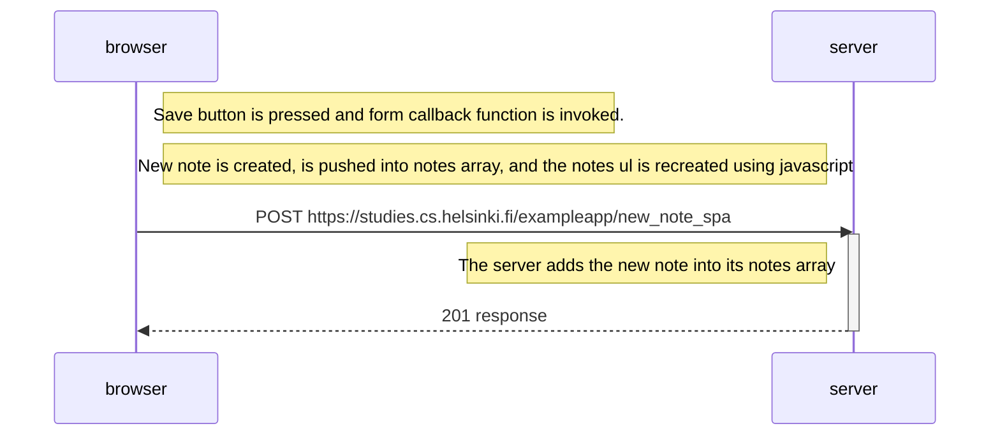

```mermaid
sequenceDiagram
    participant browser
    participant server

    Note right of browser: Save button is pressed and form callback function is invoked.
    Note right of browser: New note is created, is pushed into notes array, and the notes ul is recreated using javascript

    browser->>server: POST https://studies.cs.helsinki.fi/exampleapp/new_note_spa
    activate server
        Note left of server: The server adds the new note into its notes array
    server-->>browser: 201 response
    deactivate server
```
